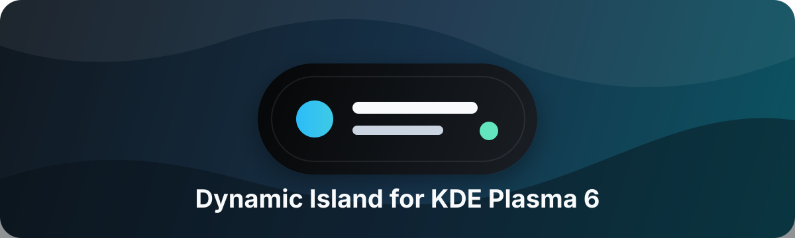

<p align="center">
  
</p>

<p align="center">
  
  
  
</p>

<p align="center">
  <a href="https://github.com/manu028-727/kde-plasma-dynamic-island/releases"></a>
  <a href="https://github.com/manu028-727/kde-plasma-dynamic-island/releases"></a>
  <a href="https://github.com/manu028-727/kde-plasma-dynamic-island/stargazers"></a>
  <a href="https://github.com/manu028-727/kde-plasma-dynamic-island/issues"></a>
  <a href="https://github.com/manu028-727/kde-plasma-dynamic-island/commits/main"></a>
  <a href="https://doc.qt.io/qt-6/qmlapplications.html"></a>
</p>

A KDE Plasma 6 widget inspired by the iOS/macOS Dynamic Island: a compact black pill for live activity plus a dark floating control-center popup.

## Instability warning

This package is in alpha state. It is usable, but bugs, visual glitches, missing edge cases, or Plasma-version-specific issues may happen while the widget is still evolving.

## Features

- Dedicated compact and expanded activity pills with priority-based switching between music, notifications, downloads/jobs, and keyboard-layout announcements.
- Real MPRIS media controls: previous, play/pause, next, album art, animated audio bars, track/artist, playback progress, and player volume when exposed.
- Plasma notification integration with app icons, images and thumbnails, multi-line previews, an animated unread indicator, and retained notification history.
- Job/download activity progress with status details and pause/resume/cancel when the source job supports it.
- Full-name keyboard-layout switch announcements in an expanded pill.
- Compact textless panel pill with black glass styling, masked album art, and quick pulse feedback for new activity.
- New activity opens a temporary floating activity popup for a configurable duration.
- Single-click idle opens the control center popup; single-click during activity reopens the activity popup; double-click opens control center.
- Middle-click toggles media playback.
- Scroll over the island to adjust the active player's volume.
- Screen-aware popup placement keeps the expanded pill and control center within the nearest display while preserving the morph animation.
- A General configuration page controls activity providers, notification previews and images, and popup durations.
- Modular control center with a JSON-backed persistent layout, graphical edit mode, drag-to-swap tiles, corner resizing, a side module palette, and a fallback default module layout.
- Control center modules include user/host/power options, media summary, notifications, volume control, brightness control, Wi-Fi, Bluetooth, battery, power mode, light/dark appearance, Theme shortcut, KDE Connect, and Settings.

## Install

For the best visual result, install **Panel Colorizer** (`luisbocanegra.panel.colorizer`) first.

Dynamic Island can run without Panel Colorizer in a normal Plasma panel, but Panel Colorizer is required for the included **Dynamic Island Panel** preset because the preset uses it to make the panel background fully transparent.

### KDE Store

Install **Dynamic Island** from Plasma's **Get New Widgets** flow, then add it from the widget picker.

For the best result, put it alone in a small centered top panel:

1. Add a new empty panel.
2. Move it to the top edge.
3. Set the panel length to fit content.
4. Set alignment to center.
5. Set height to about `50 px`. (the widget self adjusts but in my experience it looks best at 50px).
6. Add only **Dynamic Island** to that panel.
7. Set the panel opacity to translucent, or use Panel Colorizer for a fully invisible panel background.

Dynamic Island still works in a normal panel; the dedicated transparent panel is only the intended visual setup.

### Manual Install

Clone the repository and move into the project folder:

```bash
git clone https://github.com/manu028-727/kde-plasma-dynamic-island.git
cd kde-plasma-dynamic-island
```

From this folder:

```bash
kpackagetool6 --type Plasma/Applet --install .
```

If you reinstall after edits:

```bash
kpackagetool6 --type Plasma/Applet --upgrade .
```

Then add **Dynamic Island** from Plasma's widget picker.

#### Optional Panel Preset

This repository includes an optional Plasma panel preset in extras/for users installing from cloning the GitHub repository. It is not shipped in the .plasmoid release or in KDE Store because it requires Panel Colorizer (`luisbocanegra.panel.colorizer`) for the intended transparent panel setup. To install it, from the root of the project folder:

```bash
kpackagetool6 --type Plasma/LayoutTemplate --install extras/layout-template/com.manu028.dynamicisland.panel
```

You can either install it this way or follow the instructions in the KDE Store section to DIY.

After installing it, use Plasma's **Add Panel** menu and choose **Dynamic Island Panel**. The preset creates a small centered top panel, adds this widget, adds Panel Colorizer, hides Panel Colorizer's own widget during normal use, and disables the native panel background for a transparent island panel.

If you edit the preset, upgrade it with:

```bash
kpackagetool6 --type Plasma/LayoutTemplate --upgrade extras/layout-template/com.manu028.dynamicisland.panel
```

## Releases

See [CHANGELOG.md](CHANGELOG.md) for release notes.

## Intended Panel Setup

Dynamic Island is designed to sit by itself on a fully transparent, always on top, floating Plasma panel whose width is set to fit its contents. For the intended look and behavior, make the panel content-wide, enable floating mode, set the height to about `50 px`, remove any panel background/opacity, and keep Dynamic Island as the only visible widget on that panel.

KDE Store installs only the plasmoid package itself. The optional panel preset in this repository is provided for manual/GitHub installs because Plasma applets and panel layout templates are separate KDE package types.

## Notes

This targets Plasma 6 and uses the modules:

- `org.kde.plasma.private.mpris`
- `org.kde.notificationmanager`
- `org.kde.plasma.plasmoid`
- `org.kde.plasma.private.brightnesscontrolplugin`
- `org.kde.plasma.private.batterymonitor`
- `org.kde.plasma.private.battery`
- `org.kde.plasma.private.volume`
- `org.kde.plasma.networkmanagement`

Downloads appear when the app reports them as Plasma jobs, such as file copies or browser/download integrations that use KDE notifications.

The control center layout is stored in Plasma configuration as JSON and is reset automatically to a default layout when no saved layout exists. In edit mode, drag tiles onto each other to swap placement, use the corner handle to resize, drag items from the side palette to add them, or drop existing tiles onto the palette to hide them.

## Roadmap

Planned and possible directions for the project. Items are not guaranteed and may change.

- **Maintainability** — continue splitting the remaining control and integration logic out of the monolithic `main.qml`.
- **Localization (i18n)** — translate user-facing strings into additional languages.
- **Accessibility** — improved keyboard navigation and screen-reader labels.
- **Theming options** — configurable pill appearance (corner radius, width, accent color) exposed in the widget configuration.

## License

This project is licensed under the **GNU General Public License v3.0 or later** (GPL-3.0-or-later). The complete license text is available in [LICENSE](LICENSE) and on the [GNU website](https://www.gnu.org/licenses/gpl-3.0.html).

In practical terms, the GPL allows you to:

- Use the widget for any purpose, including personal or commercial use.
- Study how it works and modify the QML or other project files.
- Make and share copies of the original project.
- Share modified versions, including as part of another project.

If you distribute the original or a modified version, you must keep the GPL license and copyright notices, provide recipients with the corresponding source code (or a valid written offer for it), and license the distributed work under the GPL. You should also state clearly what you changed. The license does not require you to publish private modifications that you never distribute.

The software is provided **without warranty**, as described in the GPL. The license covers this project; KDE Plasma and any other software, services, media, or artwork that you use with the widget may have their own licenses and terms.
